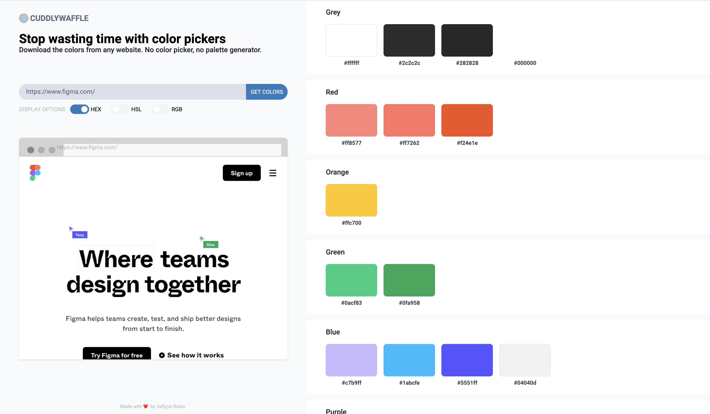

# cuddly-waffle

A quick and easy way to compare colors between a sketch file and HTML markup.



## Project setup

```
npm install
```

### Compiles and hot-reloads for development

```
npm run start:dev
```

### Compiles and minifies for production

```
npm run build
```

### Run your tests

```
npm run test
```

### Lints and fixes files

```
npm run lint
```

### Run your unit tests

```
npm run test:unit
```

## TODO

- [x] Parse HTML/CSS from a given page with Puppeteer
- [x] Display colors RGB/HEX with screenshot
- [ ] Deploy on Netlify
- [ ] Parse Sketch file with https://developer.sketch.com/reference/api/#style
- [ ] Display difference
